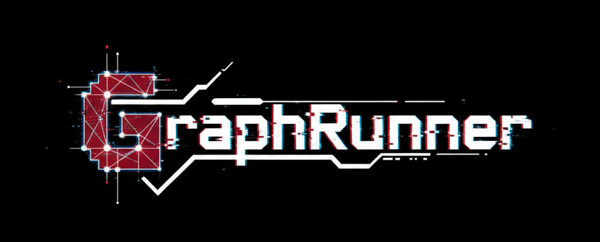


GraphRunner is a personal project to build a modern, cross-platform graphics engine from the ground up.
It features a flexible Render Hardware Interface (RHI) abstracting over Vulkan and DirectX 12, with a powerful Render Graph at its core to manage frame dependencies and rendering passes efficiently.

## Feature
GraphRunner is a modern graphics engine focused on clean architecture and high performance. Key features include:

> Currently working, not implemented yet.

### Systems
- Cross-Platform: Designed to run on multiple operating systems.
- Render Hardware Interface (RHI): A custom abstraction layer supporting both Vulkan and DirectX 12.
- Render Dependency Graph (RDG): Efficiently manages frame rendering, resource barriers, and pass dependencies.

### Advanced Rendering
Aims to implement modern techniques such as...

- Deferred Rendering
- Octree-based scene culling
- and more.

## Directory Setting
- `src/` : for implementations(*.cc).
- `include/` : for header files(*.h).
- `lib/` : static libraries to be linked.
- `tests/` : unit test based on GoogleTest.
- `example/` : some examples for features.
- `out/` : for binaries.

# How to use?

## 0. Prerequisite
- CMake 3.23 equal or over
- C++ Compiler with -std=C++20 (example: Visual Studio 2022)
- Git
- formatter : clang-format(optional)
- linter : clang-tidy(optional)

## 1. Cloning the Repo
Because of using vcpkg as a Git sub-module, `--recurse-submodules` flag is necessary.

```bash
git clone --recurse-submodules git@github.com:eldeshue/GraphRunner.git GraphRunner
```

If you already cloned tihs repo without the flag, execute command below. 
This command will initialze and update the sub-module.

```bash
cd GraphRunner
git submodule update --init --recursive
```

## 📦 2. CMake Configure
this project is baed on CMake with CMakePresets.json. 
So, choose preset you want to build and run cmake.

```bash
cmake --preset <preset-name>
```
example:
- Windows + MSVC Debug :

```bash
cmake --preset windows-msvc-debug-mode
```
- Unix-like + Clang Release:

```bash
cmake --preset unixlike-clang-release
```

## 🧱 3. Build
``` bash
cmake --build --preset <preset-name>
```

example:

``` bash
cmake --build --preset windows-msvc-debug-mode
```

## 🧪 4. Test
``` bash
ctest --preset <test-preset-name>
```

example:

``` bash
ctest --preset test-unixlike-gcc-debug
```

## 🐞 5. Debug
debug binary goes to

```bash
out/build/<preset-name>/bin/
```
for example:

```bash
./out/build/unixlike-gcc-debug/bin/my_executable
./out/build/unixlike-gcc-debug/bin/test_myproject
```
in VSCode, .vscode/launch.json needed

# ⚙️ Summary of Major Presets
- `windows-clang-release` :	Windows + Clang + Release
- `unixlike-gcc-debug` :	Linux/macOS + GCC + Debug
- `unixlike-clang-release` :	Linux/macOS + Clang + Release

for Test Presets, add test- prefix.
example: test-unixlike-clang-release

# 🚧 Warning
- License of the Package in the project is at [NOTICE.md](NOTICE.md) 

